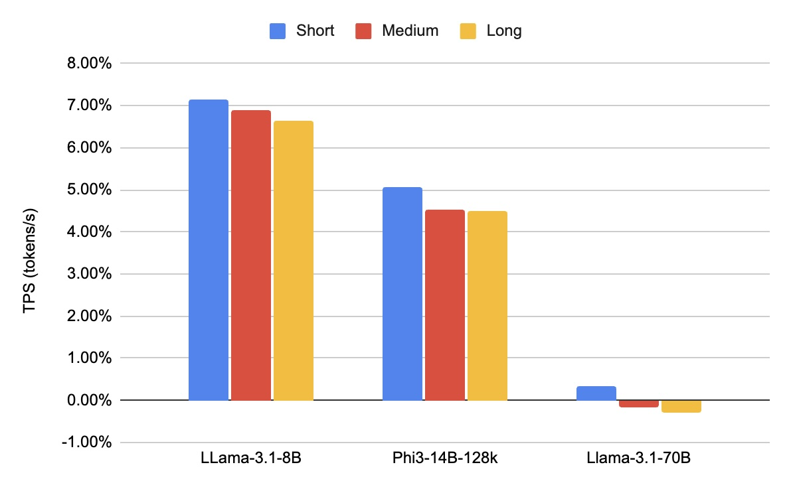
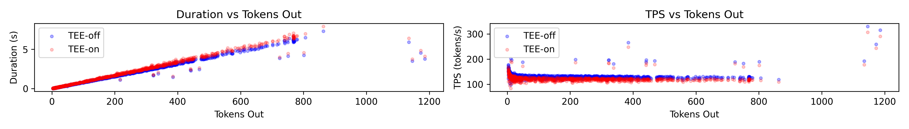
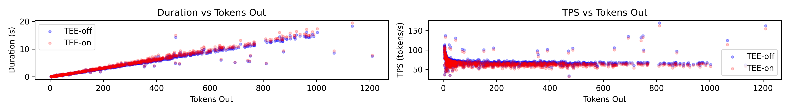
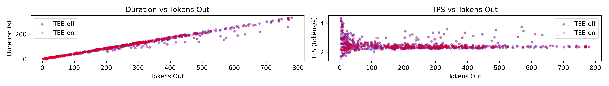

# Confidential Computing on nVIDIA H100 GPU: A Performance Benchmark Study

This report evaluates the performance impact of enabling Trusted Execution Environments (TEE) on NVIDIA H100 GPUs for large language model (LLM) inference tasks. We benchmark the overhead introduced by TEE mode across various models and token lengths, focusing on the bottleneck caused by CPU-GPU data transfers via PCIe. Our results show that while there is minimal computational overhead within the GPU, the overall performance penalty is primarily due to data transfer. For most typical LLM queries, the overhead remains below 5%, with larger models and longer sequences experiencing near-zero overhead.

If you use this benchmark in your research, we would appreciate it if you would cite us:

```
@misc{zhu2024confidentialcomputingnvidiah100,
      title={Confidential Computing on nVIDIA H100 GPU: A Performance Benchmark Study},
      author={Jianwei Zhu and Hang Yin and Shunfan Zhou},
      year={2024},
      eprint={2409.03992},
      archivePrefix={arXiv},
      primaryClass={cs.DC},
      url={https://arxiv.org/abs/2409.03992},
}
```


*Throughput overhead across different token sizes*


*Throughput vs output token size for LLama-3.1-8B*


*Throughput vs output token size for Phi3-14B-128k*


*Throughput vs output token size for Llama-3.1-70B*
